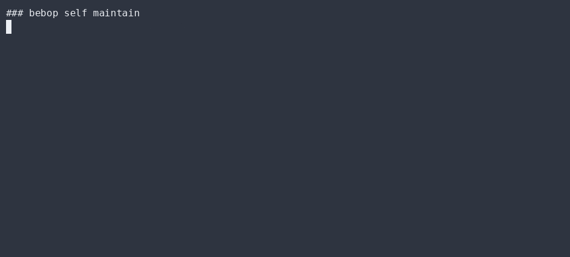
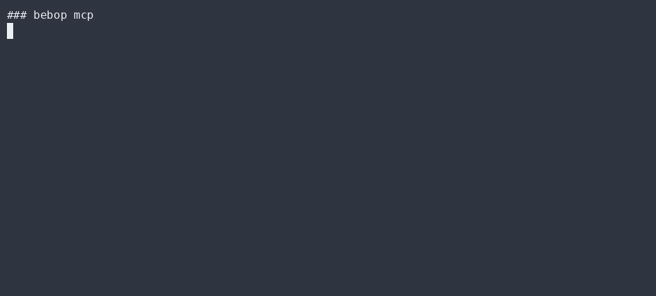

# Command reference

All commands run through the guard OS. Run `bebop help` for the live list.

| Command | What it does |
| --- | --- |
| `bebop boot` | Self-test the guard OS (red-line + scope + certify). The entry point. |
| `bebop` | Show the command list / help. For agentic work use `bebop run <class>` or `bebop dispatch "<task>"`. |
| `bebop init [--preset bebop\|--json {...}]` | Write a profile (origin, class, narration, patrons, looks, backend rotation). |
| `bebop status` | Show guard-OS status, granted scope, backend rotation, availability. |
| `bebop run [doer\|reason\|redline]` | Run the agentic loop at a task class. |
| `bebop dispatch "<task>"` | Run a task through the copilot (doer + distinct checker) and the telemetry governor. |
| `bebop route <class>` | Classify a task and show the routing decision (cheapest adequate backend). |
| `bebop recall <query>` | Associative recall from living memory. |
| `bebop remember <concept> :: <payload>` | Write a concept into living memory. |
| `bebop memory [tick\|layers]` | Inspect / advance the living-memory forgetting clock. |
| `bebop store <dir> [append\|put\|verify]` | Exercise the content-addressed, hash-chained store. |
| `bebop node [--path P --pass P]` | Show this node's post-quantum self-certifying identity. |
| `bebop govern "<samples>"` | Run the telemetry governor on a quality stream (0..1). |
| `bebop self [maintain\|evolve\|session\|loop]` | Bebop soul: self-maintenance / evolution / session-as-node. |
| `bebop run <class> [--plan] [--json]` | Run the loop; `--plan` = read-only, `--json` = headless structured output. |
| `bebop mcp` | Start the MCP stdio server (see [integrations/mcp](./integrations/mcp.md)). |

## Slash commands (interactive session)

| Command | What it does |
| --- | --- |
| `/help` | List slash commands. |
| `/status` | Backend rotation + guard-OS certification state. |
| `/model` | Show the routed model. |
| `/clear` | Reset in-process living memory. |
| `/compact` | Trim/summarize living memory (forget decay). |
| `/resume` | Resume the last session node from memory. |
| `/plan` | Show plan-mode note (`bebop run <class> --plan` to use). |
| `/skills` | List loaded skills (`.bebop/skills/*`). |
| `/review` | Run the review skill checklist + guard self-test. |
| `/subagent "<task>"` | Delegate read-only recon to a scoped, cheaper-model subagent. |

## Project settings (`bebop.json`)

```json
{
  "model": "haiku"
}
```

`bebop.json` is **untrusted**: a cloned repo may set **only `model`**. `permissions` and `hooks`
are silently ignored (and warned) — they load *only* from your user settings
(`~/.bebop/settings.json`), which is trusted. This is the guard OS's trust boundary: no project
file can relax the red-lines or install hooks. See `docs/integrations/agent-parity.md` and
`src/settings.ts` (`applyProject`).

> To extend the guard (add a red-line glob or a hook), edit `~/.bebop/settings.json`, never
> `bebop.json`.


```bash
# Certify the guard OS before trusting autonomy
bebop boot

# Watch the governor refuse an under-damped loop
bebop govern "0.9,0.95,0.9,0.2,0.1,0.95,0.9"

# Record this session as a living-memory node (freestyle bebop soul)
bebop self session hermes-now "active hermes session node"

# Plug Bebop into an MCP client
bebop mcp
```

## ▶ Live CLI

> Real `bebop` output, recorded with [asciinema](https://asciinema.org) → [agg](https://github.com/asciinema/agg) (no staging, no post-editing).

**bebop boot — certify the guard OS**


**bebop govern — watch the governor refuse an under-damped loop**


**bebop self maintain — record a session as a living-memory node**



**bebop mcp — plug Bebop into an MCP client**



