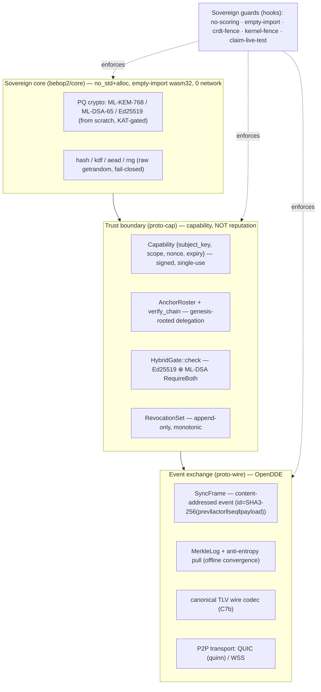

# Sovereign Event-Exchange (OpenDDE) — principles → bebop2 map, gaps, enforcement

> **Status:** blueprint (design). Not a new principles charter — the authoritative
> constraints live in `/root/dowiz/MANIFESTO.md` (C1–C13) and `/root/dowiz/DECISIONS.md`,
> which `docs/RULES.md` marks as SUPERSEDING. This doc **maps** those principles onto the
> code that already exists in `bebop2/`, names the honest gaps, and specifies which
> principles are (or become) **mechanically enforced hooks**.
>
> **TL;DR (укр):** те, що описано як «OpenDDE / суверенний обмін подіями», — це майже точний
> опис того, чим `bebop2` **вже є** (event-sourced лог, capability-підписи, canonical-TLV,
> P2P-транспорт, local-first, zero-dep sovereign core). Головне: bebop2 реалізує **здорову**
> форму — довіра = *підписана верифіковна capability*, а НЕ репутаційний скоринг/чорний
> список (є навіть гард `NO-COURIER-SCORING`). Цей документ фіксує принципи як **перевіряні
> інваріанти** і вмикає наявні гард-скрипти як реальні хуки.

## The one sentence

**Sovereignty is achieved by making every unit of state a signed, content-addressed,
canonically-encoded event that any peer can independently *verify from first principles* —
never by trusting, ranking, or blacklisting a source.**

## Honesty note — provenance, not reputation (the one thing we do NOT build)

The originating idea included a "truth engine" that marks disagreeing sources as *rotten* and
gives them zero weight. Taken as an **epistemic** mechanism that is a confirmation-bias /
echo-chamber machine, and it contradicts this project's own governing rules
(`AGENTS.md §2` Verified-by-Math, `LOGIC-LAWS.md §4` PSR-grounding, `§23` unpleasant-truth-over-
flattery, and the dowiz "ground-truth over proxy" rule). We therefore **reject the reputation
form** and keep only its sound kernel, expressed as three primitives:

1. **Cryptographic provenance** — a claim is weighted by a *verifiable signature + capability
   chain*, not by who said it or how popular it is.
2. **Independent verification** — a claim is accepted only when it re-derives from first
   principles / a falsifiable check on the *receiver's* side (this IS `guardrail-falsifiable-
   proof` + `logic-gate` + `three-model-review`, applied to data instead of code).
3. **Capability scoping** — access is a narrow, expiring, signed grant, not a trust score.

bebop2 already embodies this: `bebop2/proto-cap/src/hybrid_gate.rs::HybridGate::check` verifies a
signed delegation chain rooted in a genesis `AnchorRoster`; there is **no** score/rating/rank
field anywhere, enforced by `scripts/ci-no-courier-scoring.sh`. The healthy inversion of "black
list" here is: *you never subscribe to a node's events unless it presents a valid capability* —
absence of a grant is silence, not a maintained enemies-list.

## What "OpenDDE" means here (defined once)

**OpenDDE = Open Distributed Data Exchange** — a **novel in-repo label** for bebop2's existing
sovereign event-exchange model, so later docs can reference it by name (zero prior repo hits as of
2026-07-14). It is NOT the OMG **DDS / OpenDDS** pub-sub standard — it only shares the
decoupled-by-type idea; do not conflate them. It is the composition of five properties, each
already present in code:

| Property | Meaning | Already in bebop2 |
|---|---|---|
| Event-sourced | state = fold of an append-only, content-addressed event log | `dowiz/kernel/src/event_log.rs::MeshEvent` (+ `proto-wire/src/sync_pull.rs::SyncFrame`) |
| Decoupled by type | producer ≠ consumer; they agree only on an *event type / scope* | `proto-cap/src/scope.rs::{Resource,Action,Scope}` + `port.rs` deny-by-default |
| Schema-on-write | one canonical, injective, bounded binary encoding — no lenient parser on the trust path | `proto-cap/src/tlv.rs` (signing domain) + `sync_pull.rs::to_wire_bytes` (C7b) |
| P2P, no broker | any node is producer/consumer; no central hub | `proto-wire/src/iroh_transport.rs` (QUIC) + `wss_transport.rs` (WSS) |
| Local-first / sovereign | operates offline ("radio-silence"); core reaches no clock/RNG/socket | `bebop2/core` empty-import wasm32 build; `crates/bebop/src/sandbox.rs` fail-closed no-net |

## Principle → implementation map (ground-truth, 2026-07-14 @ `c7c6661`)

| # | Sovereign principle (MANIFESTO/RULES) | File:symbol | Maturity |
|---|---|---|---|
| 1 | Event-sourced, content-addressed state | `dowiz/kernel event_log.rs::MeshEvent`; `sync_pull.rs::SyncFrame` (`id=SHA3-256(prev‖actor‖seq‖payload)`) | MATURE (but **duplicated**: one in dowiz-kernel, one re-implemented in bebop2) |
| 2 | Anti-entropy convergence between offline nodes | `sync_pull.rs::{MerkleLog,SyncPeer::{pull,ingest}}` | MATURE (two-way convergence proven by tests) |
| 3 | P2P transport, no central broker | `iroh_transport.rs::QuicTransport` (real `quinn`+`rustls`), `wss_transport.rs::WssTransport` | MATURE (no DHT/NAT-traversal yet) |
| 4 | Trust = signed capability, NOT reputation | `capability.rs`, `roster.rs::verify_chain`, `hybrid_gate.rs::check`, `revocation.rs` | MATURE (roster-wiring + real ML-DSA PQ leg landed 2026-07-14) |
| 5 | Canonical schema-on-write | `tlv.rs` (signing domain), `sync_pull.rs` wire codec | MATURE for the **signed inner** layer; PARTIAL for the **outer wire** (still serde_json) |
| 6 | Local-first / offline / no phone-home | `core/src/rng.rs` (raw getrandom, fail-closed); `core` = 0 network calls; `sandbox.rs` | MATURE |
| 7 | Zero-dependency sovereign core | `bebop2/core` from-scratch PQ + no_std+alloc; empty-import wasm32 | MATURE |
| 8 | Red-line policy gate (auth/money/secrets/migrations) | **ABSENT in bebop2** (archived TS `guard.ts`; reinvented as physics-veto in `crates/bebop/field.rs`) | STUB |

## Honest gaps (what "OpenDDE" describes but bebop2 does not yet fully do)

- **G1 — Wire is not schema-on-write end-to-end.** Only the *signing domain* (`tlv.rs`) and
  `SyncFrame` (C7b) are canonical. The bytes each transport actually puts on the socket are
  still `serde_json::to_vec(&frame)` (`envelope.rs:42`, `iroh_transport.rs:323`,
  `wss_transport.rs:397`, `bpv7.rs:381`) — non-canonical, Rust-defined, not reproducible by a
  second-language node. → a peer can *verify* but not *re-serialize* the wire.
- **G2 — The event log is duplicated, not consolidated.** The canonical `EventLog` lives in
  `dowiz/kernel` and is reachable only via the default-OFF `kernel-rlib` feature; `bebop2`
  ships a parallel look-alike (`sync_pull.rs::SyncFrame`) with the same shape but no shared
  code — two models to keep in sync by hand.
- **G3 — Pub/sub is a typing discipline, not a bus.** `Scope`/`InboundPort`/`OutboundPort`
  decouple by event type for *authorization*, but there is no subscription registry / fan-out
  dispatcher, and the "topic" enum is split (`scope.rs::Resource` vs `sync_pull.rs::SyncResource`,
  the latter an explicit placeholder).
- **G4 — Trust root is genesis-frozen.** `AnchorRoster` is enrolled once, never rotates at
  runtime; there is no revocation-*gossip*; and `Effect::is_subset_of` (`roster.rs:73`) is flat
  equality, so delegation "attenuation" narrows nothing yet.
- **G5 — No red-line gate inside bebop2.** The deny-list guard kernel is archived TS or an
  unrelated graph-physics veto in a different crate whose `bebop boot` no longer calls it.
- **G6 — Sovereignty guards existed but were not enforced.** `ci-no-courier-scoring.sh`,
  `verify-empty-imports.sh`, `ci-crdt-fence.sh`, `ci-kernel-fence.sh`, `ci-claim-live-test.sh`
  were a *manual* RED-suite (per `docs/design/mesh-real/MESH-14-RECONCILIATION-RED-SUITE.md`),
  wired into **neither** pre-commit **nor** CI. **This blueprint's change fixes G6** (see below).
- **G7 — `NO-COURIER-SCORING` regex misses `pub` fields.** `ci-no-courier-scoring.sh:15` matches
  `^\s*name:` but not `^\s*pub\s+name:`, so a `pub score: u32` would slip through. Backstop is
  the field-limited type design; the regex should be widened. (Follow-up, not this change.)

## Enforcement matrix — principle → hook

| Principle | Hook / gate | Status |
|---|---|---|
| Verified-by-Math / first-principles validation | `guardrail-falsifiable-proof.mjs`, `logic-gate.mjs`, `three-model-review.sh` | ENFORCED (pre-commit) |
| No new dep without a falsifiable comparison (zero-trust adoption) | DECART (`AGENTS.md §5`) | process-rule; **no script yet** (follow-up: dep-diff gate) |
| No reputation/scoring/blacklist of movers | `ci-no-courier-scoring.sh` (scoped to the mesh/trust layer; `bebop2/core/` math excluded) | **WIRED by this change** (law-hooks + CI); RED-proven |
| Sovereign core reaches no clock/RNG/socket (no phone-home) | `verify-empty-imports.sh` (wasm32 empty-import) | **WIRED by this change** (CI) |
| Money/order code never depends on a CRDT-merge crate | `ci-crdt-fence.sh` | **WIRED by this change** (law-hooks + CI) |
| `proto-cap` never depends on `dowiz-kernel` (layer purity) | `ci-kernel-fence.sh` | **WIRED by this change** (law-hooks + CI) |
| A "DONE/CLOSED" mesh claim must cite a live test | `ci-claim-live-test.sh` (scans `docs/design/mesh-real/*.md` only) | **WIRED by this change** (CI) |

> **Enforcement coverage (honest):** the 3 fast guards run **per-commit** via `law-hooks.mjs`
> (local pre-commit). The full 5 run in the `sovereign-guards` CI job — but `ci.yml` triggers only
> on push/PR to `main`, so a feature-branch commit gets the 3 fast guards locally and the CI-only
> two (`verify-empty-imports`, `ci-claim-live-test`) only when a PR targets `main`.
| Canonical schema-on-write on the wire | (structural + tests today) | ADVISORY → hook is P1 (G1) |
| Append-only / content-addressed log | (type design + tests) | ADVISORY (P2 consolidation, G2) |

## Blueprints

### B1 — The sovereign stack (layers)



### B2 — Event lifecycle (produce → verify → fold), receiver decides the "event"

```mermaid
sequenceDiagram
  participant P as Producer node
  participant Net as P2P (QUIC/WSS)
  participant R as Receiver node
  P->>P: build SyncFrame; id = SHA3-256(prev‖actor‖seq‖payload)
  P->>P: sign over canonical signing_domain (Ed25519 ⊕ ML-DSA)
  P->>P: to_wire_bytes() — canonical, bounded, injective
  P->>Net: send (no broker)
  Net->>R: bytes
  R->>R: from_wire_bytes() — strict decode, reject non-canonical
  R->>R: verify sig + capability chain (HybridGate) — provenance, not reputation
  R->>R: recompute content_id — reject on mismatch
  Note over R: "Born rule": the receiver decides when a frame becomes an accepted event
  R->>R: fold if content_id new (idempotent); else no-op
```

### B3 — Trust model (capability, never a score)


## Roadmap (phased; each phase = its own gated change, DECART where a dep/protocol is touched)

- **P0 — Enforce the sovereignty invariants that already have scripts** ← *this change.* Wire
  the 5 guards into CI + the fast 3 into `law-hooks.mjs` (per-commit). Closes G6.
- **P1 — Canonical wire end-to-end (closes G1).** Replace `serde_json` in `envelope.rs` /
  transports / `bpv7.rs` with the TLV codec (extend the C7b pattern). Add a hook: "no serde_json
  on the wire path." Ship RED→GREEN.
- **P2 — Consolidate the event log (closes G2).** One `EventLog` type shared by dowiz-kernel and
  bebop2 (or a thin adapter), killing the hand-synced duplicate. `ci-kernel-fence` stays the
  layer guard.
- **P3 — Runtime trust evolution (closes G4).** Roster rotation + revocation-gossip; make
  `Effect::is_subset_of` a real narrowing lattice so attenuation attenuates. Red-line: gated.
- **P4 — Red-line policy gate inside bebop2 (closes G5).** A capability-scoped deny gate
  (auth/money/secrets/migrations) with a real `boot` self-test that proves gates go RED.
- **P5 — Topic/pub-sub bus (closes G3).** Unify `Resource`/`SyncResource`; add a subscription
  registry + fan-out so "decoupled by type" is a running bus, not only a typing discipline.
- **P-hardening — G7:** widen `ci-no-courier-scoring.sh` to also catch `pub name:` fields; add a
  DECART dep-diff script.

## What this is NOT

- **NOT an epistemic reputation filter / echo chamber.** No "rotten source" list, no scoring,
  no consensus-by-popularity. Weighting is by *verifiable provenance + independent check*, and
  bebop2 forbids scoring fields at CI time (`NO-COURIER-SCORING`).
- **NOT a new principles charter.** The authoritative constraints stay in
  `/root/dowiz/MANIFESTO.md` + `DECISIONS.md` (per `docs/RULES.md` precedence). This doc maps +
  enforces them.
- **NOT a claim that OpenDDE is finished.** G1–G7 are open; the roadmap is honest about it.
- **NOT a mandate to purge non-Rust / legacy.** Per the DECART rule and the dowiz "older-as-
  adapter, not purged" principle: bridges stay; adoption/removal is decided by falsifiable
  comparison, never by ideology.

## Cross-references (do not duplicate)

- `/root/dowiz/MANIFESTO.md`, `/root/dowiz/DECISIONS.md` — authoritative constraints (C1–C13).
- `docs/RULES.md` — precedence order + six invariants (decentralized · local-first · PQ · crypto
  · mesh · reliability-over-latency).
- `docs/design/UNIFIED-DELIVERY-PROTOCOL-BLUEPRINT-v3-2026-07-11.md` — the protocol blueprint this
  extends.
- `docs/design/delivery-protocol/{PROTOCOL-CENTRALIZATION-MAP,MATCHER-API,DECOUPLED-MATCHER}.md` —
  anti-centralization rules.
- `docs/design/mesh-real/MESH-14-RECONCILIATION-RED-SUITE.md` — event-reconciliation semantics +
  the guard scripts this change wires in.
- `docs/design/bebop-fundamental-principles-2026-07-09.md` — closest existing principles survey.
- `AGENTS.md §5` + `docs/design/INTEGRATION-DECART-RULE-2026-07-14.md` — DECART gate (required
  before adopting any new mesh/transport/dep in P1–P5).
