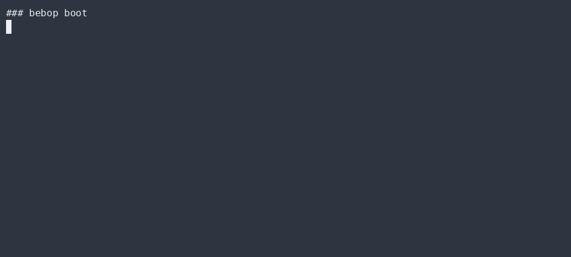

# Guard OS

`src/guard.ts` is the deterministic gate every autonomous action passes through **before** it
runs. It is the spine of Bebop's safety model and the reason the project can claim "the machine
refuses to lie."

## What it checks

1. **Red-line check** — a deny-list of globs (`RED_LINE_GLOBS` in `guard.ts`: `**/auth/**`,
   `**/migrations/**`, `**/rls/**`, `**/*.sql`, `**/packages/db/migrations/**`, `**/money/**`,
   `**/payments/**`, `**/bulk-edit/**`, `**/secret/**`, `**/secrets/**`, `**/.env`,
   `**/.env.*`). A red-line command is refused *unless* it carries a human approval token.
   **Fail-closed**: if the check can't run, the command is denied.
2. **Scope check** — paths are matched against a glob allow-list (`DEFAULT_SCOPE_GLOBS` in
   `guard.ts`: `tools/bebop/**`, `docs/design/dowiz-agent-cli/**`). A command touching a file
   outside the granted scope is denied. `checkScope()` is the pure function; `guard.test.ts`
   asserts both a GREEN in-scope path and a RED out-of-scope path.
3. **Certification** — a deterministic self-test (`selfTest()`) that proves the gate actually
   blocks the bad cases. `bebop boot` runs it; if the gate is broken, nothing autonomous runs.

## Why it's trustworthy

- **Pure**: given the same command + scope it always returns the same verdict. No clock, no RNG,
  no network inside the decision path.
- **Self-certifying**: the gate proves its own red/green behavior via `selfTest()`, which
  returns `{ ok, log }`. The CLI prints the log and exits non-zero if `ok` is false.
- **Tested RED+GREEN**: `guard.test.ts` asserts the gate *denies* a red-line command (RED) and
  *passes* an in-scope one (GREEN). A test that can't fail is a false-positive metric.

## Example

```
$ bebop boot
  · gate 'redline-deny' certified: green on good, red on bad.
  · gate 'scope-block' certified: green on good, red on bad.
  ✓ Bebop guard OS certified: gates deny on red, pass on green.
```

## Extending the guard OS

Add a red-line glob to `RED_LINE_GLOBS`, or a new scope glob to `DEFAULT_SCOPE_GLOBS`, in
`guard.ts`. Every change must keep
`selfTest()` green — the gate's own proof is the regression test.

## ▶ Live CLI

> Real `bebop` output, recorded with [asciinema](https://asciinema.org) → [agg](https://github.com/asciinema/agg) (no staging, no post-editing).

**bebop boot — guard self-test (red-line + scope gates must go RED and GREEN)**



**bebop dispatch — runs only after the guard clears the task**


