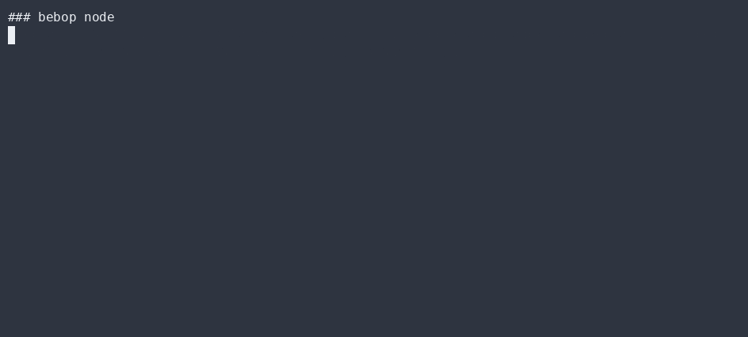

# Post-quantum identity & vault

`src/crypto.ts` + `src/vault.ts` give every Bebop node a **self-certifying, post-quantum**
identity that survives restarts — and fails closed on tamper.

## The identity

Each node gets two key pairs from [`@noble`](https://paulmillr.com/noble/):

- **ML-KEM (Kyber)** — post-quantum KEM for forward-secret key exchange.
- **Ed25519** — signature key for authentication and non-repudiation.

The node id is **derived from the public keys**:

```ts
nodeIdFromPublic(pqPublic, edPublic) -> id   // id = H(pqPublic || edPublic)
```

So a swapped or tampered key blob produces a *different* id → the vault refuses to unlock.
Identity is **self-certifying**: you don't need a CA to trust a node, only its public keys.

## The vault: encrypted at rest

```ts
createOrUnlock(path, passphrase) -> NodeIdentity
```

- Identity is encrypted with **XChaCha20-Poly1305** (from `@noble/ciphers`); the key is derived
  from the passphrase via **scrypt**.
- Secrets never leave the file. A wrong passphrase → AEAD authentication failure → **nothing**
  is decrypted. Fail-closed.
- `lock()` / `unlock()` manage the in-memory session; `loadBlob()` reads a sealed payload.

## Why this matters

- **Post-quantum today** — ML-KEM means a "harvest-now-decrypt-later" attacker gets nothing.
- **No central directory** — nodes recognize each other by id, not by a server.
- **Falsifiable** — `vault.test.ts` asserts (GREEN) a correct passphrase unlocks, and (RED) a
  wrong passphrase / tampered blob fails closed.

## Try it

```bash
bebop node
# node id=◈… (encrypted vault .bebop/node.vault.json)
# pqPublic=… edPublic=…
```

## ▶ Live CLI

> Real `bebop` output, recorded with [asciinema](https://asciinema.org) → [agg](https://github.com/asciinema/agg) (no staging, no post-editing).

**bebop node — post-quantum identity + encrypted vault**



