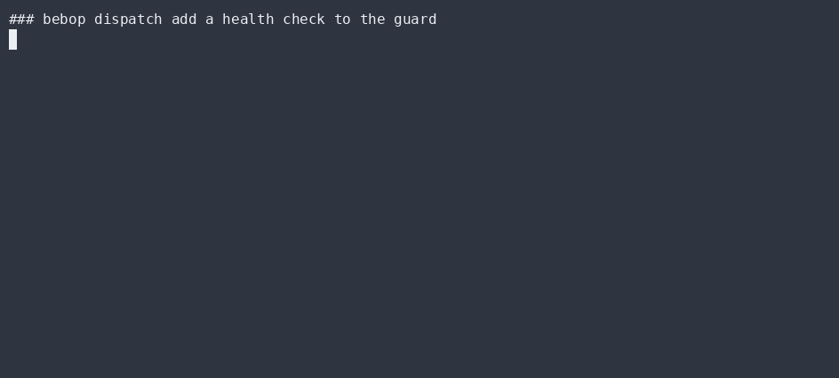
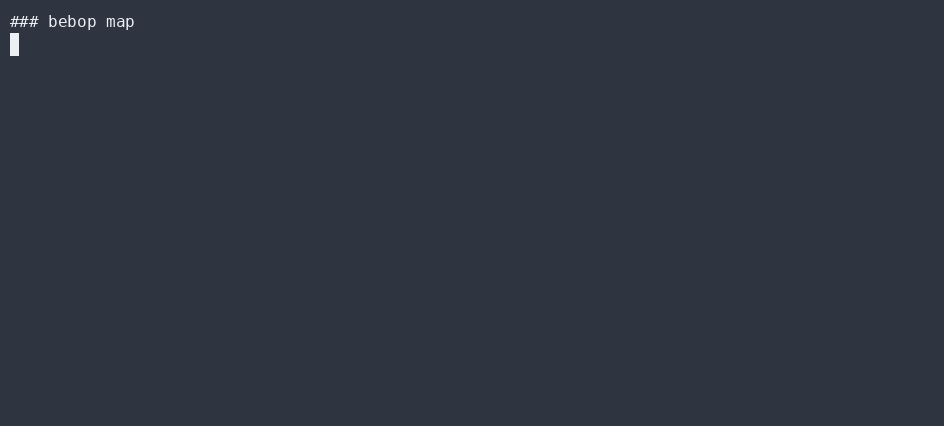

# Deterministic kernel & content-addressed log

`src/kernel.ts` + `src/store.ts` are the source of truth. They are pure and deterministic:
given the same input, they always produce the same bytes.

## The one door: `decide`

```ts
decide(command: Command, state: State): Event[]
```

- Forbidden transitions are explicit `DomainError`s — never panics, never silently corrupts.
- `fold(state, event) -> state` projects state forward.
- `replay(events) -> state` rebuilds state from the log — fully deterministic, fully replayable.

## The universal Checker gate

A transition is validated by a `Checker` **before** admission. The same abstraction gates:
- the **local** kernel (a `Command` becomes an `Event` only if it checks), and
- the **mesh** scale (a receiving node reuses the identical invariant to admit/reject a gossiped
  envelope).

This is "as above, so below": one rule, two scales. A violating transition is quarantined into
`DENIED` and never admitted into honest state.

## The log: hash-chained & tamper-evident

`src/store.ts` (`ContentStore`) appends events where each entry is hashed together with the
previous entry's hash:

```
event[n].hash = H(event[n].payload || event[n-1].hash)
```

`verifyChain()` walks the log and returns `false` on any tamper. The same primitive backs
`putPiece` / `getPiece` — a content-addressed store where a piece's address *is* its SHA-256.

## Why this matters

- **Auditability** — every state change is a replayable, verifiable event.
- **Falsifiability** — a corrupt log fails `verifyChain()`; a bad transition fails the Checker.
  Both are asserted by `store.test.ts` and `core.test.ts`.
- **No central server** — the log is just bytes; any node can hold a copy and verify it.

## ▶ Live CLI

> Real `bebop` output, recorded with [asciinema](https://asciinema.org) → [agg](https://github.com/asciinema/agg) (no staging, no post-editing).

**bebop dispatch — decide() gates, then fold() applies through the Checker**



**bebop map — real import graph of the kernel and its neighbours**



