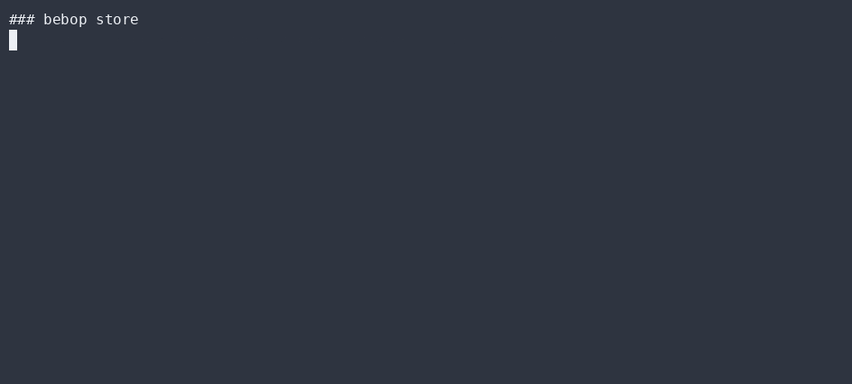

# No-central-server mesh

`src/torrent.ts` + `src/mesh.ts` move data between nodes **without a server you must trust**.
The transport is a seam — today it's an in-memory swarm (zero deps, fully testable); tomorrow it
can be libp2p or hyperswarm behind the *same* interface.

## Content-addressed pieces

`src/torrent.ts` splits a payload into fixed-size pieces and hashes each with SHA-256. The
piece's **address is its hash**; an `infoHash` is a self-certifying Merkle-style root over the
piece hashes.

```ts
split(payload) -> { infoHash, pieces: [{ index, hash, bytes }] }
```

## Verified exchange

A node asks peers "do you have infoHash X?" and pulls pieces by hash. **No piece is accepted
unless its hash validates** — a malicious or buggy peer cannot inject bad data. Dedup is free:
same hash = same bytes.

```ts
requestPiece(peer, hash) -> bytes | null   // verifies before returning
```

## The mesh port (swap-not-rewrite)

`src/mesh.ts` defines a `MeshTransport` interface:

```ts
interface MeshTransport {
  announce(infoHash): void;
  query(infoHash): Peer[];
  pull(peer, hash): Promise<Uint8Array>;
}
```

The in-memory `Swarm` implements it today. libp2p/hyperswarm implement the *same* port later —
the kernel (ordering, dedup via `cause`) doesn't care which bytes moved. That's why adding a
real P2P backend is a swap, not a rewrite.

## Why no server

- **Censorship-resistant** — there's no single endpoint to block or coerce.
- **Tamper-evident** — content addressing means you can't lie about what you sent.
- **Falsifiable** — `core.test.ts` asserts a piece's hash matches (GREEN) and that a corrupted
  piece is rejected (RED). (Kernel, torrent, and mesh are exercised together in `core.test.ts`.)

## ▶ Live CLI

> Real `bebop` output, recorded with [asciinema](https://asciinema.org) → [agg](https://github.com/asciinema/agg) (no staging, no post-editing).

**bebop store — content-addressed mesh pieces**



