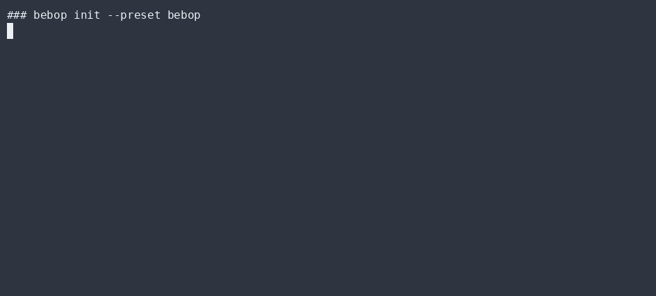

# Getting started

## Install

Bebop needs **Node.js ≥ 20.19**. The core installs with **zero heavy/native dependencies** —
`better-auth` (multi-device sync) is optional and lazy-loaded.

```bash
# Global
npm install -g bebop-agent
bebop boot          # self-test the guard OS

# Or from source (best for forking)
git clone https://github.com/SyniakSviatoslav/bebop.git
cd bebop
npm install         # core deps only
npm run boot
npm test            # 165 falsifiable tests
```

To enable optional multi-device sync later:

```bash
npm i -D better-auth
bebop sync --port 8787
```

## Your first run

```bash
bebop                 # show the command list / help (agentic work: `bebop run <class>` or `bebop dispatch "<task>"`)
bebop status          # show backend rotation + guard-OS scope
bebop recall "what did we decide about the kernel envelope?"
bebop govern "0.9,0.6,0.2,0.95,0.1"   # watch the telemetry governor track a setpoint
bebop node            # show this machine's post-quantum self-certifying identity
```

## Configure

Bebop reads configuration from **environment variables** (it never loads cloud keys from files):

| Variable | Meaning |
| --- | --- |
| `BEBOP_MEMORY_PATH` | Living-memory JSONL path (default `~/.bebop/memory.json`). |
| `BEBOP_SCOPE` | Comma-separated granted scopes (`read,write-file,exec`). |
| `BEBOP_APPROVAL` | Human approval token that unlocks a red-line action for one run. |
| `BEBOP_BACKEND` | Default backend for the loop. |
| `BEBOP_SYNC` | `1` to enable the optional sync server. |
| `BEBOP_DB` | SQLite file for sync (optional; in-memory otherwise). |
| `BEBOP_AUTH_SECRET` | Session secret for sync (generate a strong one for prod). |

## What "boot" proves

`bebop boot` runs the **guard-OS self-certification**: it asserts the gate *denies on red* and
*passes on green*. If the gate can't be proven to block the bad cases, Bebop refuses to run
autonomously. This is the load-bearing safety check — run it after every change.

## ▶ Live CLI

> Real `bebop` output, recorded with [asciinema](https://asciinema.org) → [agg](https://github.com/asciinema/agg) (no staging, no post-editing).

**bebop boot — first run, guard self-test**


**bebop init --preset bebop — personalize on 5 axes**



