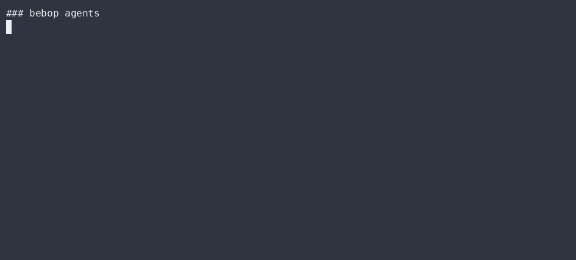
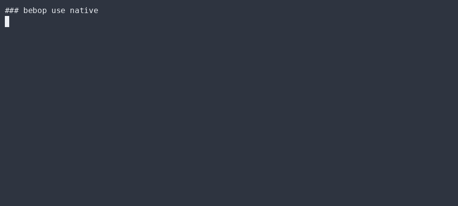
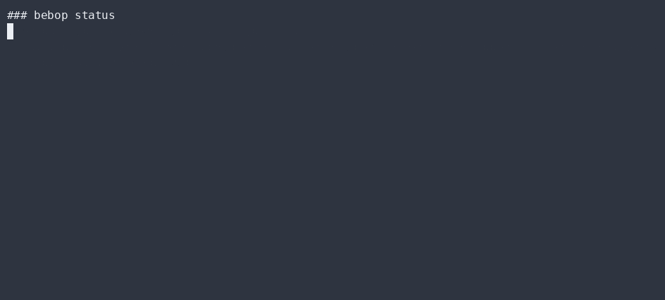

# Backends & routing

Bebop is **backend-agnostic**. A **Task Router** classifies each task and routes to the
**cheapest adequate backend** — local models, cloud APIs, or a native doer.

## The Backend interface

Bebop abstracts each agentic CLI as a `BackendAdapter` (registered in `src/backend.ts`):

```ts
interface BackendAdapter {
  id: Backend;                 // 'free' | 'opencode' | 'claude' | 'codex' | 'hermes' | 'goose' | 'aider' | 'native'
  label: string;               // human label for the selector
  binary: string | null;       // binary name it shells out to (`native` has none)
  requiredEnv: string[];       // env vars that must be present (BYOK, read from the vault)
  detect(): boolean;           // is the binary installed / resolvable?
  buildArgs(task, opts): string[];  // argv for a one-shot task run
  parse(stdout): string;       // parse raw stdout into a short envelope summary
}
```

`runBackend(backend, task, { model?, yolo?, runNative? })` executes it and feeds the result into
the unified token ledger (`token.ts`) — no backend meters its own tokens.

## Routing: cheapest adequate

`src/router.ts` classifies a task into one of three classes — `doer` (narrow mechanical edit),
`reason` (design/analysis), `redline` (money/auth/RLS/migrations — must escalate) — and returns
the cheapest model that satisfies it:

```ts
route('reason')  // -> { model: 'sonnet', rationale: '...' }   (opus is reserved for red-lines)
enforceRouting('reason', model)  // { ok, note }
```

`route('doer')` → `haiku`, `route('reason')` → `sonnet`, `route('redline')` → `opus`.
`src/routing.ts` (`probeAll` / `selectBackend`) probes which backends are installed/available
and selects among them. The CLI shows this with `bebop status` and `bebop route <class>`.

## Bring your own model

1. Add a `Backend` implementation (local Ollama, an OpenAI-compatible API, a native doer, …).
2. Register it in `probeAll` / `selectBackend`.
3. The router picks it by capability + cost. No core change needed.

## Why this matters

- **Cost-aware** — cheap tasks never burn an expensive model.
- **Portable** — point Bebop at whatever you have; the core doesn't care.
- **Falsifiable** — `bebop.test.ts` asserts the routing decision for each class (RED+GREEN: redline→opus, doer→haiku, and a redline routed to haiku is a violation).

## Token ledger

All backends report usage into one ledger (`token.ts`) so you get a single, comparable cost view
across models and providers — no per-backend accounting drift.

## ▶ Live CLI

> Real `bebop` output, recorded with [asciinema](https://asciinema.org) → [agg](https://github.com/asciinema/agg) (no staging, no post-editing).

**bebop agents — every agentic CLI Bebop can drive**



**bebop use native — switch the active backend**



**bebop status — rotation + connection health**



